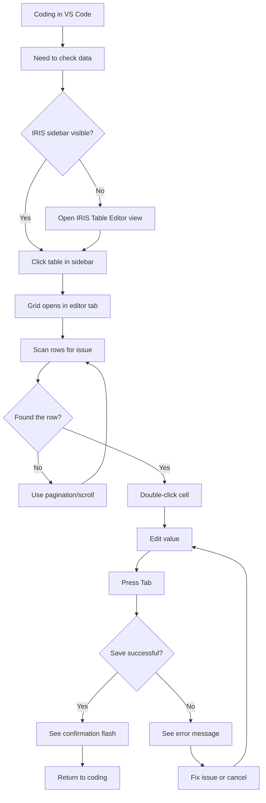
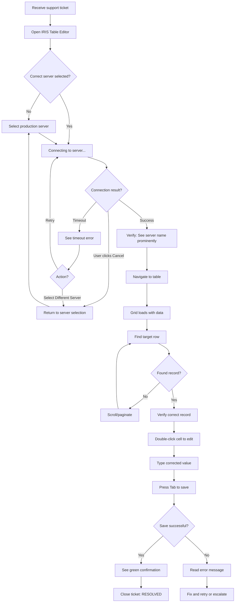
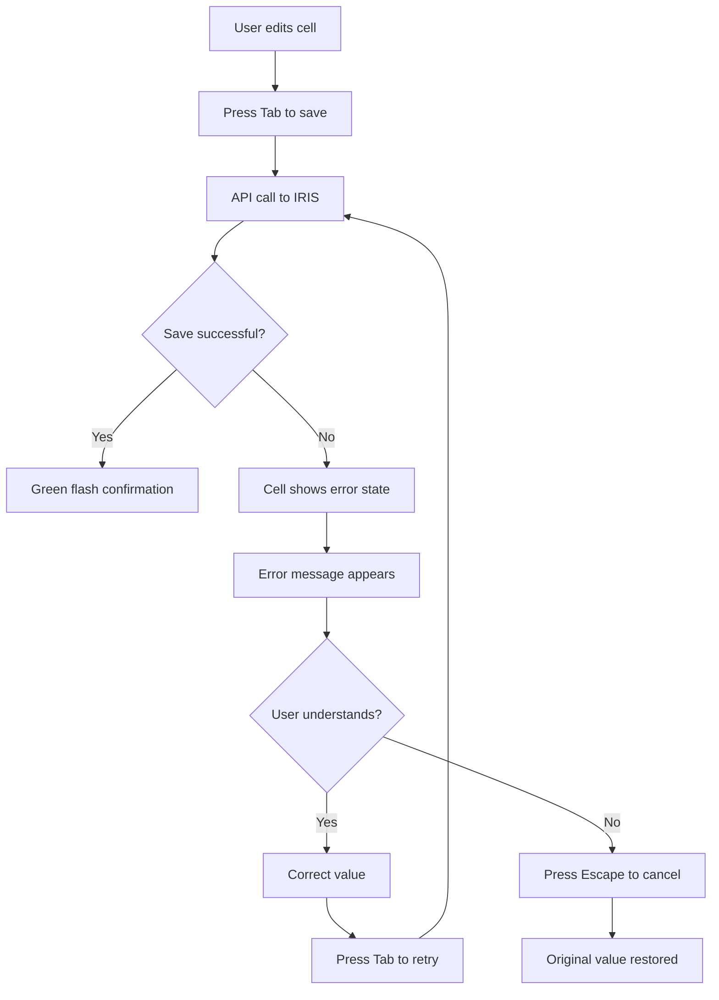
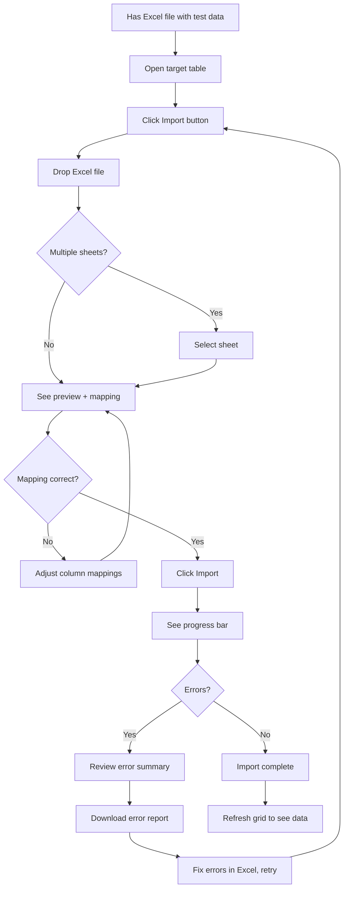
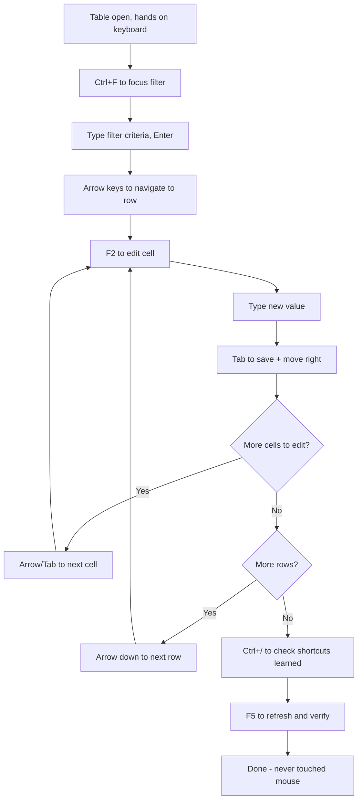

---
stepsCompleted:
  - 1
  - 2
  - 3
  - 4
  - 5
  - 6
  - 7
  - 8
  - 9
  - 10
  - 11
  - 12
  - 13
  - 14
lastStep: 14
workflowComplete: true
inputDocuments:
  - _bmad-output/planning-artifacts/prd.md
  - _bmad-output/planning-artifacts/architecture.md
  - docs/initial-prompt.md
documentCounts:
  prd: 1
  architecture: 1
  projectDocs: 1
  briefs: 0
project_name: iris-table-editor
user_name: Developer
date: '2026-01-27'
---

# UX Design Specification - iris-table-editor

**Author:** Developer
**Date:** 2026-01-27

---

<!-- UX design content will be appended sequentially through collaborative workflow steps -->

## Executive Summary

### Project Vision

IRIS Table Editor delivers an **Excel-like grid editing experience** for InterSystems IRIS database tables within VS Code. The core UX promise is enabling users to **edit table data in 30 seconds** instead of minutes spent writing SQL queries.

The extension follows a **navigation + editor pattern**:
- **Sidebar panel** for server connection, namespace browsing, and table selection
- **Main editor area** for full-width table grid editing (opens as editor tabs)

This mirrors VS Code's native file explorer → editor paradigm, making the interaction model immediately familiar to users.

### Target Users

| Persona | Role | Primary Use Case | UX Priority |
|---------|------|------------------|-------------|
| **Marcus** | Backend Developer | Quick data inspection during development; spot and fix data issues without context-switching | Speed, keyboard navigation, minimal friction |
| **Sarah** | Operations/Support | Production data fixes for support tickets; needs confidence she's editing the right data | Clarity, confirmation, server/namespace visibility |

**Shared Characteristics:**
- Comfortable with VS Code environment
- Familiar with database concepts (tables, rows, columns, primary keys)
- Value efficiency over hand-holding
- Expect professional-grade error messages

### Key Design Challenges

1. **Sidebar ↔ Editor Coordination**
   - Table selection in sidebar must smoothly open/focus the grid editor tab
   - Clear affordance for "open table" action (double-click or explicit button)

2. **Connection Context Visibility**
   - Each editor tab must clearly display server + namespace context
   - Prevent accidental edits to wrong environment (especially production vs. development)

3. **Dirty State & Save Flow**
   - Visual indication of pending/unsaved changes at cell and row level
   - Handle tab close with unsaved changes (prompt or auto-save?)
   - Clear feedback on successful saves

4. **Error Recovery**
   - Transform technical SQL errors into actionable guidance
   - Help users understand what went wrong AND how to fix it

### Design Opportunities

1. **Tab-Based Multi-Table Workflow**
   - Open multiple tables as editor tabs simultaneously
   - Support VS Code split-view for side-by-side comparison
   - Tab titles show `TableName (Namespace@Server)` for context

2. **Keyboard-First Editing**
   - Tab/Enter/Escape navigation for power users
   - Potential differentiator for developer audience

3. **Visual Change Tracking**
   - Modified cells highlighted before save
   - Clear "review changes" moment before committing

4. **30-Second Happy Path**
   - Minimize clicks: sidebar select → grid opens → click cell → type → Tab to save
   - Optimize for the common case, not edge cases

## Core User Experience

### Defining Experience

The core user action for IRIS Table Editor is **editing a cell value and saving it back to the database**. This atomic interaction is the unit of value - everything else (connecting, browsing, selecting tables) exists to enable this moment.

The experience must feel like editing a local spreadsheet, with the added confidence that changes persist to the live database instantly.

### Platform Strategy

| Aspect | Decision | Rationale |
|--------|----------|-----------|
| **Platform** | VS Code Extension (Desktop) | Target users already live in VS Code |
| **Input Model** | Mouse + Keyboard | Developer tooling standard |
| **Offline Support** | None | Requires live IRIS connection by nature |
| **VS Code Integration** | Sidebar navigation, editor tabs, theming, command palette | Leverage familiar patterns |

### Effortless Interactions

These interactions must feel completely natural and require zero thought:

| Interaction | Expected Behavior |
|-------------|-------------------|
| Double-click cell | Enter edit mode immediately |
| Tab / Enter | Save current cell, move to next |
| Escape | Cancel edit, restore original value |
| Click away | Save current cell |
| Ctrl+S | Save all pending changes |
| Browse tables | Tree view with search/filter |

### Critical Success Moments

1. **First Edit Saved** - User edits cell, tabs away, sees save confirmation. Trust established.
2. **Error Recovery** - Invalid data produces actionable guidance, not cryptic SQL errors.
3. **Context Clarity** - Production vs. development is always visually obvious.
4. **Fast Table Load** - 500 rows loads in under 2 seconds. Feels snappy.

### Experience Principles

1. **Spreadsheet Familiarity** - Leverage Excel muscle memory for all grid interactions
2. **Context Confidence** - Server/namespace/table always visible and unambiguous
3. **Instant Feedback** - Every action produces immediate visual response
4. **Keyboard-First, Mouse-Friendly** - Both interaction modes are first-class
5. **Fail Safe, Recover Fast** - Prevent damage, guide recovery when errors occur

## Desired Emotional Response

### Primary Emotional Goals

For a professional developer tool, emotional design focuses on **removing friction and building trust** rather than entertainment or delight.

| Emotion | Description | Why It Matters |
|---------|-------------|----------------|
| **Confident** | "I know exactly what I'm editing and I trust it will work" | Users take action without hesitation |
| **Efficient** | "This just saved me 5 minutes of writing SQL" | Validates the tool's core value proposition |
| **In Control** | "I can see my changes, undo if needed, nothing happens until I'm ready" | Users feel safe to explore and edit |

### Emotional Journey Mapping

| Stage | Desired Feeling | Design Implication |
|-------|-----------------|-------------------|
| **First Discovery** | "This looks straightforward" | Clean, uncluttered UI; obvious entry point |
| **First Connection** | "That was easy, I'm in" | Server picker with minimal steps |
| **First Edit** | "It works like a spreadsheet" | Familiar interaction patterns |
| **Successful Save** | "Done. Confirmed. Moving on." | Clear visual confirmation |
| **Error Encountered** | "I understand what went wrong" | Actionable error messages |
| **Return Visit** | "Right where I left off" | Remember last server/namespace |

### Micro-Emotions

**Cultivate:**
- **Confidence** - User always knows what's happening
- **Trust** - Tool won't corrupt or lose data
- **Accomplishment** - Task completed, time saved
- **Competence** - Tool feels intuitive to use

**Prevent:**
- **Anxiety** - "Did that save? Is this production?"
- **Doubt** - "Is this showing current data?"
- **Frustration** - "Why isn't this working?"
- **Dread** - "I hope I don't break something"

### Emotional Design Principles

1. **Confirm, Don't Assume** - Every save gets explicit visual confirmation
2. **Context Always Visible** - Server/namespace shown prominently to prevent wrong-environment edits
3. **Errors Guide, Not Blame** - Error messages explain the problem AND suggest resolution
4. **Safe to Explore** - Undo available, changes visible before commit, deletions require confirmation
5. **Professional Tone** - No cutesy language; respect user expertise

## UX Pattern Analysis & Inspiration

### Inspiring Products Analysis

**Microsoft Excel** - The gold standard for grid editing:
- Double-click → type → Tab/Enter to save
- Arrow keys for navigation, clear focus indicators
- Undo/Redo for confidence
- Visual dirty state (asterisk in title)

**Microsoft Access (Datasheet View)** - Database-aware grid editing:
- Row-based operations (select row, delete row)
- New row affordance at bottom of grid
- Auto-save on row change
- Field type-aware editing (date pickers, checkboxes)

**VS Code Native Patterns** - Platform consistency:
- Sidebar tree → editor tab paradigm
- Tab-based multi-document workflow
- Command palette for power users
- Consistent theming and visual language

**IRIS Management Portal** - Current user workflow (baseline):
- Users must write SQL for any data changes
- No inline editing capability
- Requires context-switching out of VS Code

### Transferable UX Patterns

| Category | Pattern | Source | Application |
|----------|---------|--------|-------------|
| Navigation | Sidebar tree hierarchy | VS Code | Server → Namespace → Table |
| Navigation | Tab-per-document | VS Code | Each table opens as editor tab |
| Interaction | Direct cell edit | Excel | Double-click or type to edit |
| Interaction | Tab/Enter navigation | Excel | Tab = save + move right |
| Interaction | New row at bottom | Access | Empty row for insertion |
| Visual | Modified cell highlight | Excel | Distinct color for unsaved changes |
| Visual | Active cell border | Excel | Bold border on selected cell |

### Anti-Patterns to Avoid

| Anti-Pattern | Problem | Our Approach |
|--------------|---------|--------------|
| SQL required for edits | High friction for simple changes | Direct cell manipulation |
| Modal edit dialogs | Interrupts flow | Inline editing only |
| Unclear save state | Causes anxiety | Explicit visual confirmation |
| Generic errors | Not actionable | Specific guidance messages |
| Hidden context | Wrong-server mistakes | Always-visible server/namespace |

### Design Inspiration Strategy

**Adopt:** Excel's cell editing model, VS Code's sidebar→tab paradigm, Access's row affordances

**Adapt:** Undo to work with database commits, auto-save as optional behavior

**Avoid:** SQL workflows, modal dialogs, unclear feedback, generic errors

## Design System Foundation

### Design System Choice

**Hybrid Approach**: VS Code Webview UI Toolkit + Custom Grid Component

For a VS Code extension, the design system is constrained by platform requirements. We adopt a hybrid approach that maximizes consistency while allowing customization for the core data grid.

### Rationale for Selection

| Factor | Decision Driver |
|--------|-----------------|
| **Platform Constraint** | VS Code extensions must use VS Code CSS variables for theming |
| **User Expectation** | Extension UI should feel native to VS Code |
| **Core Interaction** | Data grid needs custom behavior for Excel-like editing |
| **Development Speed** | Toolkit provides ready-made standard components |
| **Theme Compatibility** | Automatic support for all VS Code themes |

### Implementation Approach

| Component Type | Implementation | Source |
|----------------|----------------|--------|
| **Sidebar Controls** | VS Code Webview UI Toolkit | Dropdowns, buttons, tree views |
| **Data Grid** | Custom implementation or extended vscode-data-grid | Cell editing, selection, navigation |
| **Toolbar** | VS Code Webview UI Toolkit | Action buttons, refresh, filters |
| **Dialogs** | VS Code Webview UI Toolkit | Confirmations, error displays |
| **Notifications** | VS Code API | Toast messages for save confirmation |
| **All Styling** | VS Code CSS Variables | `--vscode-*` for theme compatibility |

### Customization Strategy

**Standard Components (No Customization):**
- Buttons, dropdowns, text inputs → use toolkit defaults
- Match VS Code native appearance exactly

**Custom Components (Full Control):**
- Data grid cell editing behavior
- Modified cell highlighting
- Row selection indicators
- Keyboard navigation within grid

**Theming (Mandatory):**
- All colors via `--vscode-editor-*`, `--vscode-input-*`, etc.
- No hardcoded colors
- Automatic light/dark theme support

### CSS Architecture

Use BEM naming with `ite-` prefix (per architecture.md):

```css
.ite-grid { }
.ite-grid__cell { }
.ite-grid__cell--modified { }
.ite-grid__cell--editing { }
.ite-grid__row--selected { }
```

All colors reference VS Code variables:

```css
.ite-grid__cell--modified {
  background-color: var(--vscode-diffEditor-insertedTextBackground);
}
```

## Defining Experience

### Core Interaction Statement

**"Double-click a cell, type a value, press Tab - it's saved to the database."**

This is what users will describe to colleagues: *"You just click on the cell, type the new value, hit Tab, and it's done. No SQL. No forms. Just like Excel, but it's your database."*

### User Mental Model

**Current Workflow (Pain):**
- Open IRIS Management Portal in browser
- Navigate to SQL execution area
- Write UPDATE statement with correct syntax
- Execute and hope for no errors

**Expected Mental Model:**
- "Editing data should be like editing a spreadsheet"
- "I should see the data and change it directly"
- "Tab moves to the next cell" (Excel muscle memory)
- "Changes should save automatically or with minimal effort"

**Potential Confusion Points:**

| Risk | Mitigation |
|------|------------|
| "Did it actually save?" | Explicit visual confirmation |
| "Which cell am I editing?" | Bold border on active cell |
| "Is this production?" | Prominent server/namespace context |

### Success Criteria

| Criteria | Target |
|----------|--------|
| **Speed** | Edit → Save completes in < 500ms |
| **Feedback** | Visual confirmation within 200ms |
| **Familiarity** | Zero learning curve for Excel users |
| **Confidence** | User never wonders "did it save?" |
| **Recovery** | Escape cancels, original value restored |

### Pattern Strategy

**Established Patterns (Direct Adoption):**
- Double-click to edit (Excel)
- Tab to save + move right (Excel)
- Enter to save + move down (Excel)
- Escape to cancel (Universal)

**Unique Twist:**
- Live database commit (not local file)
- Context header showing Server > Namespace > Table
- Instant confirmation feedback

### Experience Mechanics

**Initiation:**

| Trigger | Result |
|---------|--------|
| Double-click cell | Edit mode, cursor at end |
| Start typing on selected cell | Edit mode, content replaced |
| F2 on selected cell | Edit mode, cursor at end |

**During Edit:**

| Action | Result |
|--------|--------|
| Tab | Save, move right |
| Enter | Save, move down |
| Shift+Tab | Save, move left |
| Escape | Cancel, restore original |
| Click away | Save, select clicked cell |

**Feedback:**

| Event | Visual Response |
|-------|-----------------|
| Save initiated | Brief loading indicator |
| Save succeeded | Green flash, return to normal |
| Save failed | Error styling, message displayed |

## Visual Design Foundation

### Color System

**Strategy: Full VS Code Theme Adaptation**

No custom brand colors. All visual styling derives from VS Code's CSS variables, ensuring the extension looks native in any theme (light, dark, high contrast).

**Semantic Color Mapping:**

| Purpose | VS Code Variable | Usage |
|---------|------------------|-------|
| Background | `--vscode-editor-background` | Grid background |
| Foreground | `--vscode-editor-foreground` | Cell text |
| Border | `--vscode-editorGroup-border` | Cell borders, dividers |
| Selection | `--vscode-list-activeSelectionBackground` | Selected cell/row |
| Hover | `--vscode-list-hoverBackground` | Row hover state |
| Modified | `--vscode-diffEditor-insertedTextBackground` | Unsaved cell changes |
| Error | `--vscode-inputValidation-errorBackground` | Failed save, validation error |
| Input | `--vscode-input-background` | Cell in edit mode |
| Header | `--vscode-editorWidget-background` | Column headers |

**Color Principles:**
1. Never hardcode colors - always use CSS variables
2. Test in light, dark, and high contrast themes
3. Semantic meaning comes from VS Code's existing conventions

### Typography System

**Strategy: Inherit VS Code Fonts**

| Element | Font | Source |
|---------|------|--------|
| UI text (labels, buttons) | System UI | `--vscode-font-family` |
| Data cells | Monospace | `--vscode-editor-font-family` |
| Font size | User preference | `--vscode-font-size` |

**Typography Principles:**
1. Data cells use monospace for column alignment
2. No custom fonts - respect user settings
3. No font size overrides - accessibility first

### Spacing & Layout Foundation

**Base Unit:** 4px (VS Code standard)

**Spacing Scale:**

| Token | Value | Usage |
|-------|-------|-------|
| `--ite-space-xs` | 2px | Cell padding vertical |
| `--ite-space-sm` | 4px | Cell padding horizontal, icon gaps |
| `--ite-space-md` | 8px | Section gaps, toolbar padding |
| `--ite-space-lg` | 16px | Major section separation |

**Layout Dimensions:**

| Element | Size | Rationale |
|---------|------|-----------|
| Row height | 24px | Matches VS Code list items |
| Header height | 32px | Visual hierarchy, room for sort icons |
| Cell min-width | 60px | Readable minimum |
| Toolbar height | 36px | Room for buttons + padding |

**Layout Principles:**
1. **Data First** - Maximize grid area, minimize surrounding chrome
2. **Consistent Rhythm** - All spacing in multiples of 4px
3. **Dense but Readable** - Prioritize data visibility without sacrificing legibility

### Accessibility Considerations

| Requirement | Implementation |
|-------------|----------------|
| **Color Contrast** | Inherited from VS Code themes (already accessible) |
| **High Contrast Mode** | Full support via VS Code variables |
| **Keyboard Navigation** | Arrow keys, Tab, Enter, Escape all functional |
| **Focus Indicators** | Clear cell focus border (2px solid) |
| **Screen Readers** | ARIA labels on interactive elements |
| **Font Scaling** | Respects VS Code font size settings |

## Design Direction

### Chosen Direction: Clean Data-First Grid

A minimal, data-focused layout that maximizes grid visibility and follows spreadsheet conventions users already know.

**Design Philosophy:**
- Data is the hero - minimize chrome, maximize grid area
- Essential actions only - no feature bloat
- Spreadsheet familiarity - looks and behaves like Excel/Access

### Layout Structure

```
┌─────────────────────────────────────────────────────────────┐
│ [🔄] [➕] [🗑️]  │  server > NAMESPACE > Table              │  ← Toolbar + Context
├─────────────────────────────────────────────────────────────┤
│ ☐ │ ID   │ Name        │ Email              │ Status    │  ← Headers
├───┼──────┼─────────────┼────────────────────┼───────────┤
│ ☐ │ 1    │ John Smith  │ john@example.com   │ Active    │  ← Data
│ ☐ │ 2    │ [editing]   │                    │           │  ← Edit mode
│ ● │ 3    │ Modified    │ changed@ex.com     │ Pending   │  ← Modified
│   │      │             │                    │           │  ← New row
├─────────────────────────────────────────────────────────────┤
│ Rows 1-50 of 127                    [◀ Prev] [Next ▶]      │  ← Pagination
└─────────────────────────────────────────────────────────────┘
```

### Component Decisions

| Component | Decision | Rationale |
|-----------|----------|-----------|
| **Toolbar** | Icon buttons: Refresh, Add Row, Delete Row | Minimal, essential actions |
| **Context Bar** | Breadcrumb: `server > namespace > table` | Always-visible location |
| **Row Selector** | Checkbox column on left | Familiar from Excel, enables multi-select |
| **Column Headers** | Sticky, sortable (click to sort) | Standard data grid behavior |
| **Cell Editing** | Inline, input expands within cell | Natural spreadsheet feel |
| **New Row** | Empty row at bottom | Access pattern, obvious affordance |
| **Pagination** | Bottom bar with prev/next + row count | Simple, non-intrusive |

### Visual States

| State | Indicator |
|-------|-----------|
| **Selected cell** | 2px solid border (focus ring) |
| **Editing cell** | Input field with cursor |
| **Modified cell** | Background tint (diff-inserted color) |
| **Modified row** | Filled circle in selector column |
| **Error cell** | Red border + error background |
| **Hover row** | Subtle background highlight |

### Rationale

This direction was chosen because:
1. **Aligns with "30-second edit" goal** - No learning curve, instant productivity
2. **Follows established patterns** - Excel/Access users feel immediately at home
3. **Platform-appropriate** - Looks native in VS Code
4. **Extensible** - Can add power features (filters, search) later without redesign

### Future Enhancements (Not MVP)

Reserved for later iterations:
- Column filtering/search
- Column visibility toggles
- Export to CSV
- Bulk edit mode
- Custom SQL query mode

## User Journey Flows

### Journey 1: Developer Daily Flow

**Persona:** Marcus (Developer)
**Goal:** Quick data check/fix during coding
**Success:** Edit complete in < 30 seconds



### Journey 2: Operations Data Fix

**Persona:** Sarah (Operations)
**Goal:** Fix production data for support ticket
**Success:** Confident, correct edit in 3 minutes



### Journey 3: Error Recovery

**Persona:** Any user
**Goal:** Understand and recover from save failure
**Success:** Clear path to resolution



**Error Message Format:**

```
❌ Save failed: [Error Type]
   [Human-readable explanation]
   [Suggested action if applicable]
```

### Journey Patterns

**Navigation Patterns:**

| Pattern | Implementation |
|---------|----------------|
| Sidebar → Editor | Table click opens grid in editor tab |
| Breadcrumb context | `server > namespace > table` always visible |
| Pagination | Bottom bar with prev/next + row range |

**Interaction Patterns:**

| Pattern | Trigger | Result |
|---------|---------|--------|
| Start edit | Double-click, F2, or type | Cell enters edit mode |
| Save + advance | Tab or Enter | Saves cell, moves focus |
| Cancel edit | Escape | Restores original value |

**Feedback Patterns:**

| State | Visual Indicator |
|-------|------------------|
| Saving | Brief spinner or pulse |
| Success | Green background flash |
| Error | Red border + message |
| Modified | Tinted background |

### Flow Optimization Principles

1. **Minimize time-to-edit** - < 5 clicks from opening to editing first cell
2. **No modal interruptions** - All feedback inline
3. **Fail safe** - Errors don't lose work, easy retry or cancel
4. **Context always visible** - Server/namespace shown at all times

## Component Strategy

### Design System Components (VS Code Webview UI Toolkit)

| Component | Usage |
|-----------|-------|
| `<vscode-button>` | Toolbar actions (Refresh, Add, Delete) |
| `<vscode-dropdown>` | Server picker, namespace selector |
| `<vscode-checkbox>` | Row selection |
| `<vscode-progress-ring>` | Loading indicators |
| `<vscode-data-grid>` | Base grid structure |
| `<vscode-divider>` | Visual separation |

### Custom Components

#### `ite-cell` - Editable Grid Cell

**Purpose:** Display and edit table cell values inline

**States:**

| State | CSS Class | Visual |
|-------|-----------|--------|
| Default | `.ite-cell` | Plain text |
| Selected | `.ite-cell--selected` | 2px focus border |
| Editing | `.ite-cell--editing` | Input field |
| Modified | `.ite-cell--modified` | Tinted background |
| Saving | `.ite-cell--saving` | Pulse animation |
| Saved | `.ite-cell--saved` | Green flash (200ms) |
| Error | `.ite-cell--error` | Red border + tooltip |

**Accessibility:**
- `role="gridcell"`
- `aria-selected` for selection state
- `aria-invalid` for error state

#### `ite-context-bar` - Breadcrumb Navigation

**Purpose:** Show current server > namespace > table location

**Structure:**

```html
<div class="ite-context-bar">
  <span class="ite-context-bar__server">dev-server</span>
  <span class="ite-context-bar__separator">›</span>
  <span class="ite-context-bar__namespace">NAMESPACE</span>
  <span class="ite-context-bar__separator">›</span>
  <span class="ite-context-bar__table">Customer</span>
</div>
```

#### `ite-row-selector` - Row Selection Column

**Purpose:** Select rows for bulk operations, indicate modified state

**States:**

| State | Visual |
|-------|--------|
| Unchecked | Empty checkbox |
| Checked | Checked checkbox |
| Modified | Filled circle indicator |
| New row | Plus icon or empty |

#### `ite-pagination` - Pagination Controls

**Purpose:** Navigate large result sets

**Structure:**

```html
<div class="ite-pagination">
  <span class="ite-pagination__info">Rows 1-50 of 127</span>
  <vscode-button class="ite-pagination__prev">◀ Prev</vscode-button>
  <vscode-button class="ite-pagination__next">Next ▶</vscode-button>
</div>
```

### Component Implementation Strategy

| Layer | Approach |
|-------|----------|
| **Foundation** | VS Code Webview UI Toolkit components |
| **Grid Structure** | Extend `vscode-data-grid` |
| **Cell Editing** | Custom JS + CSS for inline editing |
| **State** | AppState class (per architecture.md) |
| **Styling** | BEM with `ite-` prefix, CSS variables |

### Implementation Roadmap

**Phase 1 - Core (MVP):**
- `ite-cell` with all editing states
- `ite-context-bar` for location display
- `ite-pagination` for data navigation
- Basic grid layout with toolkit buttons

**Phase 2 - Enhancement:**
- `ite-row-selector` with multi-select
- Column sorting indicators
- Keyboard navigation refinements

**Phase 3 - Power Features (Post-MVP):**
- Column filtering
- Search/find in table
- Export functionality

## UX Consistency Patterns

### Button Hierarchy

| Level | Usage | Visual | Examples |
|-------|-------|--------|----------|
| **Primary Action** | Single main action per context | `<vscode-button>` default | "Add Row" when grid is empty |
| **Secondary Actions** | Supporting actions | `<vscode-button appearance="secondary">` | Refresh, Delete Row |
| **Icon-Only Actions** | Toolbar actions with tooltips | `<vscode-button appearance="icon">` | Refresh icon, Add icon, Delete icon |

**Button Placement Rules:**
- Toolbar buttons: Left-aligned, action icons only
- Context bar: Right side of toolbar
- Pagination: Right side of footer bar
- Destructive actions (Delete): Always require row selection first, never bulk-delete without confirmation

### Feedback Patterns

| Event | Pattern | Duration | Visual |
|-------|---------|----------|--------|
| **Save Success** | Background flash | 200ms | `--vscode-diffEditor-insertedTextBackground` fades to normal |
| **Save Error** | Inline error + border | Persistent until fixed | Red border + tooltip with error text |
| **Loading** | Progress indicator | While loading | `<vscode-progress-ring>` in cell or toolbar |
| **Info Message** | VS Code notification | 3 seconds | `vscode.window.showInformationMessage()` |
| **Error Message** | VS Code notification + inline | Until dismissed | `vscode.window.showErrorMessage()` + cell error state |

**Feedback Principles:**
1. **Inline first** - Cell-level feedback stays in context
2. **No modal interruptions** - Toast/notification for completion, never blocking dialogs
3. **Error specificity** - "Value exceeds maximum length (50)" not "Invalid input"
4. **Success is subtle** - Brief flash, then done. Don't celebrate saving.

### Form Patterns (Cell Editing)

| Aspect | Pattern | Rationale |
|--------|---------|-----------|
| **Edit Trigger** | Double-click, F2, or start typing | Excel/Access muscle memory |
| **Input Style** | Native `<input>` styled to match cell | Seamless inline appearance |
| **Validation** | On blur/submit, not real-time | Don't interrupt typing |
| **Error Display** | Red border + tooltip | Clear but non-blocking |
| **Cancel** | Escape restores original | Safe to experiment |
| **Submit** | Tab, Enter, click away | Multiple familiar options |

**Text Overflow:**
- Display: Truncate with ellipsis
- Editing: Input scrolls horizontally
- Hover: Full value in tooltip (for long values)

### Navigation Patterns

| Navigation | Trigger | Result |
|------------|---------|--------|
| **Open table** | Click/double-click in sidebar | Grid opens in editor tab |
| **Close table** | Click X on tab | Prompt if unsaved changes |
| **Switch tables** | Click different tab | Tabs work like VS Code |
| **Pagination** | Click Prev/Next buttons | Load new page, preserve selection column |
| **Cell navigation** | Arrow keys | Move selection within visible grid |
| **Exit edit mode** | Tab/Enter/Escape/Click away | Per form patterns above |

**Keyboard Navigation:**

| Key | In View Mode | In Edit Mode |
|-----|--------------|--------------|
| Arrow keys | Move cell selection | Move cursor in input |
| Tab | Move right + select | Save + move right + select |
| Shift+Tab | Move left + select | Save + move left + select |
| Enter | Enter edit mode | Save + move down + select |
| Escape | Clear selection | Cancel edit, restore value |
| F2 | Enter edit mode | N/A (already editing) |

### Loading & Empty States

| State | Display | Actions Available |
|-------|---------|-------------------|
| **Connecting** | "Connecting to [server]..." + progress ring + Cancel button | Cancel (returns to server selection) |
| **Connection timeout** | "Could not reach [server]. The server may be offline." | Retry, Select Different Server |
| **Connection cancelled** | Returns to server selection UI | Select server |
| **Loading data** | Progress ring centered in grid area | Cancel (close tab) |
| **No rows** | "No data in table" + "Add Row" button | Add Row |
| **No tables** | "No tables in namespace" | Select different namespace |
| **Connection error** | Error message + "Retry" button | Retry, select different server |
| **Page loading** | Progress ring in pagination area | None (brief) |

**Connecting State Layout (Story 1.7):**

```
┌─────────────────────────────────────────────┐
│                                             │
│    Connecting to dev-server...              │
│                                             │
│           [  progress ring  ]               │
│                                             │
│              [ Cancel ]                     │
│                                             │
└─────────────────────────────────────────────┘
```

**Connection Timeout State Layout (Story 1.7):**

```
┌─────────────────────────────────────────────┐
│                                             │
│    Could not reach "dev-server"             │
│    The server may be offline or slow.       │
│                                             │
│  [ Retry ]    [ Select Different Server ]   │
│                                             │
└─────────────────────────────────────────────┘
```

**CSS Classes:**

```css
.ite-connecting { text-align: center; padding: var(--ite-space-lg); }
.ite-connecting__message { margin-bottom: var(--ite-space-md); }
.ite-connecting__progress { margin-bottom: var(--ite-space-md); }
.ite-connecting__cancel { }
.ite-connection-error { text-align: center; padding: var(--ite-space-lg); }
.ite-connection-error__message { margin-bottom: var(--ite-space-md); }
.ite-connection-error__actions { display: flex; gap: var(--ite-space-md); justify-content: center; }
```

**Accessibility:**
- Progress ring has `aria-label="Connecting to server"`
- Cancel button has `aria-label="Cancel connection attempt"`
- Timeout state uses `role="alert"` for screen reader announcement
- Retry and Select Different Server buttons are keyboard-focusable

**Empty State Messaging:**
- Keep text minimal and actionable
- Always provide a path forward
- Use VS Code's visual language (no custom illustrations)

### Pattern Integration with Design System

**VS Code Toolkit Components Used:**

| Pattern | Component |
|---------|-----------|
| Buttons | `<vscode-button>` with appearance variants |
| Checkboxes | `<vscode-checkbox>` for row selection |
| Progress | `<vscode-progress-ring>` for loading |
| Dropdowns | `<vscode-dropdown>` for filters (future) |

**Custom Pattern Implementations:**

| Pattern | Implementation |
|---------|----------------|
| Cell editing | Custom `<input>` styled with VS Code variables |
| Feedback flash | CSS animation using `--vscode-diffEditor-insertedTextBackground` |
| Error tooltips | Custom positioned tooltip using VS Code colors |
| Keyboard nav | Custom JS handling on grid container |

## Responsive Design & Accessibility

### Responsive Strategy

**Platform: VS Code Desktop Only**

IRIS Table Editor runs exclusively in VS Code webview panels. Traditional mobile/tablet responsive design doesn't apply, but the extension must handle various panel sizes gracefully.

**Panel Size Scenarios:**

| Scenario | Width Range | Adaptation |
|----------|-------------|------------|
| **Narrow sidebar** | 200-300px | Sidebar tree view only (not for grid) |
| **Half-width editor** | 400-600px | Grid with horizontal scroll, fewer visible columns |
| **Full-width editor** | 800-1200px | Grid shows more columns, comfortable editing |
| **Wide editor** | 1200px+ | Maximum data visibility, optional column spread |

**Responsive Behaviors:**

| Element | Behavior |
|---------|----------|
| **Grid columns** | Fixed minimum widths, horizontal scroll when needed |
| **Toolbar** | Icons collapse to dropdown menu at narrow widths |
| **Context bar** | Truncates with ellipsis, full text in tooltip |
| **Pagination** | Stacks vertically below 400px width |
| **Cell content** | Truncates with ellipsis, full value on hover/edit |

### Breakpoint Strategy

**CSS Breakpoints for Webview:**

```css
/* Narrow panel (sidebar or split view) */
@media (max-width: 500px) {
  .ite-toolbar__actions { /* Icon-only mode */ }
  .ite-pagination { /* Stacked layout */ }
}

/* Standard panel */
@media (min-width: 501px) and (max-width: 900px) {
  /* Default layout */
}

/* Wide panel */
@media (min-width: 901px) {
  /* Enhanced data density options */
}
```

**Sizing Principles:**
1. Never break functionality at any panel width
2. Horizontal scroll is acceptable for data grids (Excel pattern)
3. Prioritize toolbar and context visibility over column count
4. Minimum usable width: 300px (for split editors)

### Accessibility Strategy

**Compliance Target: WCAG 2.1 AA**

This level is appropriate for developer tools and aligns with VS Code's own accessibility standards.

**Core Accessibility Requirements:**

| Category | Requirement | Implementation |
|----------|-------------|----------------|
| **Color Contrast** | 4.5:1 minimum | Inherited from VS Code themes |
| **Keyboard Navigation** | Full functionality without mouse | Arrow keys, Tab, Enter, Escape |
| **Focus Indicators** | Visible focus state | 2px solid border on cells |
| **Screen Readers** | Semantic structure | ARIA roles and labels |
| **High Contrast** | Full support | Via VS Code's high contrast themes |

**ARIA Implementation:**

```html
<div role="grid" aria-label="Table data for Customer">
  <div role="row" aria-rowindex="1">
    <div role="columnheader" aria-colindex="1">ID</div>
    <div role="columnheader" aria-colindex="2">Name</div>
  </div>
  <div role="row" aria-rowindex="2">
    <div role="gridcell" aria-colindex="1" tabindex="0">1</div>
    <div role="gridcell" aria-colindex="2" aria-selected="true">John</div>
  </div>
</div>
```

**Keyboard Accessibility Matrix:**

| Action | Keyboard | Screen Reader Announcement |
|--------|----------|---------------------------|
| Navigate cells | Arrow keys | "Row 2, Column Name, value: John" |
| Select cell | Enter or Space | "Selected" |
| Edit cell | F2 or typing | "Editing Name, current value John" |
| Save edit | Tab or Enter | "Saved" or "Error: [message]" |
| Cancel edit | Escape | "Edit cancelled, restored to John" |
| Delete row | Delete (with selection) | "Delete row? Press Enter to confirm" |

### Testing Strategy

**Accessibility Testing:**

| Method | Tools | Frequency |
|--------|-------|-----------|
| **Automated scan** | axe-core, VS Code accessibility checker | Every build |
| **Keyboard testing** | Manual | Every feature |
| **Screen reader** | NVDA (Windows), VoiceOver (Mac) | Before release |
| **Color contrast** | VS Code theme testing | When adding visual states |

**Responsive Testing:**

| Method | Approach |
|--------|----------|
| **Panel resizing** | Test at 300px, 500px, 800px, 1200px widths |
| **Split editors** | Test grid behavior in 2-up and 3-up layouts |
| **Sidebar mode** | Verify tree view works in narrow sidebar |

**Checklist Before Release:**

- [ ] Tab through entire UI without mouse
- [ ] All actions available via keyboard
- [ ] Focus visible at all times
- [ ] Screen reader announces all state changes
- [ ] Works in VS Code High Contrast theme
- [ ] Grid scrolls properly at minimum width
- [ ] Toolbar adapts at narrow widths

### Implementation Guidelines

**HTML/CSS:**

```css
/* Always use focus-visible for keyboard users */
.ite-cell:focus-visible {
  outline: 2px solid var(--vscode-focusBorder);
  outline-offset: -2px;
}

/* Respect reduced motion preference */
@media (prefers-reduced-motion: reduce) {
  .ite-cell--saved {
    animation: none;
    background-color: var(--vscode-diffEditor-insertedTextBackground);
  }
}

/* Never rely on color alone */
.ite-cell--error {
  border: 2px solid var(--vscode-inputValidation-errorBorder);
  /* Error icon also shown, not just color */
}
```

**JavaScript:**

```javascript
// Manage focus programmatically after actions
function onSaveComplete(cell) {
  cell.focus(); // Return focus to cell
  announceToScreenReader('Saved successfully');
}

// Live region for dynamic announcements
function announceToScreenReader(message) {
  const liveRegion = document.getElementById('ite-live-region');
  liveRegion.textContent = message;
}
```

**Development Principles:**
1. Test keyboard navigation before committing
2. Add ARIA labels when purpose isn't obvious from text
3. Use semantic HTML (`<button>` not `<div onclick>`)
4. Announce dynamic changes via live regions
5. Respect user's motion preferences

---

## Growth Phase: Scalability Components (Epic 6)

This section defines UX components for handling namespaces with thousands of tables and tables with millions of rows.

### Schema-Based Table Tree View

**Purpose:** Replace flat table list with hierarchical schema → table navigation

**Structure:**

```
┌─────────────────────────────────┐
│ Tables                    [🔄]  │
├─────────────────────────────────┤
│ 📁 Analytics                    │  ← Collapsed schema
│ 📂 Customer                     │  ← Expanded schema
│    ├─ Address                   │
│    ├─ Contact                   │
│    └─ Person                    │
│ 📁 Inventory                    │
│ 📁 Order                        │
│ SingleTableSchema.MyTable       │  ← Single-table at root
└─────────────────────────────────┘
```

**Behavior:**
- Click folder icon to expand/collapse schema
- Only one schema expanded at a time (accordion)
- Single-table schemas display at root level (no folder)
- Expansion state preserved on refresh
- Alphabetical sort for schemas and tables

**CSS Classes:**

```css
.ite-tree { }
.ite-tree__schema { }
.ite-tree__schema--expanded { }
.ite-tree__schema-icon { }  /* 📁 or 📂 */
.ite-tree__schema-label { }
.ite-tree__schema-count { } /* (5 tables) */
.ite-tree__table { }
.ite-tree__table--selected { }
```

**Accessibility:**
- `role="tree"` on container
- `role="treeitem"` on schemas and tables
- `aria-expanded` on schema folders
- Arrow keys for navigation

---

### Inline Filter Row

**Purpose:** Quick column filtering directly below headers

**Layout:**

```
┌──────┬─────────────┬────────────────────┬───────────┐
│ ID   │ Name        │ Email              │ Status    │  ← Headers
├──────┼─────────────┼────────────────────┼───────────┤
│ [  ] │ [John*    ] │ [              ]   │ [▼ All  ] │  ← Filter row
├──────┼─────────────┼────────────────────┼───────────┤
│ 1    │ John Smith  │ john@example.com   │ Active    │  ← Data
```

**Filter Input Types:**

| Cardinality | UI Component | Behavior |
|-------------|--------------|----------|
| ≤10 distinct values | Dropdown checklist | Multi-select checkboxes |
| >10 distinct values | Text input | Wildcards: `*` = any, `?` = single char |

**Checklist Dropdown:**

```
┌─────────────────────┐
│ ☑ Active            │
│ ☑ Pending           │
│ ☐ Inactive          │
│ ☑ Archived          │
├─────────────────────┤
│ [Select All] [Clear]│
└─────────────────────┘
```

**Text Input with Wildcards:**

```
┌─────────────────────────────────┐
│ John*                         🔍│
│ ─────────────────────────────── │
│ Wildcards: * = any, ? = single  │
└─────────────────────────────────┘
```

**Visual States:**

| State | Appearance |
|-------|------------|
| Empty (no filter) | Subtle placeholder text |
| Active filter | Highlighted background, bold border |
| Disabled (toggled off) | Grayed out, italic text, value preserved |

**CSS Classes:**

```css
.ite-filter-row { }
.ite-filter-row--disabled { }  /* Toggle off state */
.ite-filter-input { }
.ite-filter-input--active { }
.ite-filter-input--disabled { }
.ite-filter-dropdown { }
.ite-filter-dropdown__option { }
.ite-filter-dropdown__option--selected { }
```

---

### Filter Panel

**Purpose:** Advanced filtering with operators, synced with inline row

**Layout:**

```
┌──────────────────────────────────────────┐
│ Filters                           [✕]    │
├──────────────────────────────────────────┤
│ ⚡ Filters: ON / OFF                     │  ← Toggle
├──────────────────────────────────────────┤
│ Name                                     │
│ [Contains    ▼] [John           ] [✕]   │
│                                          │
│ Status                                   │
│ [Equals      ▼] [Active         ] [✕]   │
│                                          │
│ Created Date                             │
│ [Greater than▼] [2024-01-01     ] [✕]   │
├──────────────────────────────────────────┤
│ [+ Add Filter]           [Clear All]     │
└──────────────────────────────────────────┘
```

**Operators:**

| Operator | Text Fields | Numeric/Date |
|----------|-------------|--------------|
| Contains | ✓ | - |
| Starts with | ✓ | - |
| Ends with | ✓ | - |
| Equals | ✓ | ✓ |
| Not equals | ✓ | ✓ |
| Greater than | - | ✓ |
| Less than | - | ✓ |
| Is empty | ✓ | ✓ |
| Is not empty | ✓ | ✓ |

**Sync Behavior:**
- Changes in panel immediately update inline row
- Changes in inline row immediately update panel
- Inline shows value only; panel shows operator + value

**CSS Classes:**

```css
.ite-filter-panel { }
.ite-filter-panel__header { }
.ite-filter-panel__toggle { }
.ite-filter-panel__row { }
.ite-filter-panel__column-label { }
.ite-filter-panel__operator { }
.ite-filter-panel__value { }
.ite-filter-panel__remove { }
.ite-filter-panel__actions { }
```

---

### Column Sort Indicators

**Purpose:** Visual feedback for sort state on column headers

**States:**

| State | Indicator | Header Appearance |
|-------|-----------|-------------------|
| Unsorted | None (hover reveals affordance) | Normal |
| Ascending | ▲ | Bold, indicator visible |
| Descending | ▼ | Bold, indicator visible |

**Interaction:**
1. Click unsorted → Ascending (▲)
2. Click ascending → Descending (▼)
3. Click descending → Unsorted (clear)
4. Click different column → New column ascending, previous cleared

**Layout:**

```
┌──────────────────┬──────────────────┬──────────────────┐
│ ID               │ Name         ▲   │ Email            │
│                  │ (sorted asc)     │                  │
└──────────────────┴──────────────────┴──────────────────┘
```

**CSS Classes:**

```css
.ite-header { }
.ite-header--sortable { cursor: pointer; }
.ite-header--sorted { font-weight: bold; }
.ite-header__sort-indicator { }
.ite-header__sort-indicator--asc::after { content: '▲'; }
.ite-header__sort-indicator--desc::after { content: '▼'; }
```

**Accessibility:**
- `aria-sort="ascending"` or `aria-sort="descending"` on sorted header
- Click action announced: "Sorted by Name, ascending"

---

### Enhanced Pagination Bar

**Purpose:** Full navigation control for large datasets

**Layout:**

```
┌─────────────────────────────────────────────────────────────────────┐
│ Rows 2,051-2,100 of 1,234,567    [⏮] [◀] Page [42] of 24,692 [▶] [⏭] │
└─────────────────────────────────────────────────────────────────────┘
```

**Components:**

| Element | Description |
|---------|-------------|
| Row count | "Rows X-Y of Z" with thousands separators |
| First (⏮) | Jump to page 1 |
| Previous (◀) | Go back one page |
| Page input | Editable text field, current page |
| Page total | "of X" label |
| Next (▶) | Go forward one page |
| Last (⏭) | Jump to last page |

**Button States:**

| Position | First/Prev | Next/Last |
|----------|------------|-----------|
| Page 1 | Disabled | Enabled |
| Middle | Enabled | Enabled |
| Last page | Enabled | Disabled |

**Page Input Behavior:**
- Type number + Enter → navigate
- Blur (click away) → navigate
- Invalid input (text, 0, negative, > max) → revert + error flash

**CSS Classes:**

```css
.ite-pagination { }
.ite-pagination__info { }           /* Row count */
.ite-pagination__button { }
.ite-pagination__button--disabled { opacity: 0.5; cursor: not-allowed; }
.ite-pagination__page-input { width: 60px; text-align: center; }
.ite-pagination__page-input--error { border-color: var(--vscode-inputValidation-errorBorder); }
.ite-pagination__page-total { }
```

**Accessibility:**
- Buttons have `aria-label` (e.g., "Go to first page")
- Page input has `aria-label="Current page"`
- Disabled buttons have `aria-disabled="true"`

---

### Toolbar Enhancements

**Updated Toolbar Layout:**

```
┌─────────────────────────────────────────────────────────────────────────┐
│ [🔄] [➕] [🗑️]  │  [🔽 Filters: ON] [🧹 Clear]  │  server > NS > Table  │
│ Refresh Add Delete   Filter Toggle   Clear All      Context breadcrumb  │
└─────────────────────────────────────────────────────────────────────────┘
```

**New Toolbar Buttons:**

| Button | Icon | Action |
|--------|------|--------|
| Filter Panel | 🔽 (funnel) | Open/close filter panel |
| Toggle Filters | Part of filter button | Enable/disable without clearing |
| Clear All Filters | 🧹 (broom) | Remove all filter criteria |

**Filter Toggle States:**

| State | Button Appearance |
|-------|-------------------|
| Filters ON (active) | Highlighted, "Filters: ON" |
| Filters OFF (disabled) | Dimmed, "Filters: OFF" |
| No filters set | Normal, "Filters" |

**CSS Classes:**

```css
.ite-toolbar__filter-toggle { }
.ite-toolbar__filter-toggle--active { }
.ite-toolbar__filter-toggle--disabled { opacity: 0.7; }
.ite-toolbar__clear-filters { }
```

---

## Growth Phase: Data Type Polish Components (Epic 7)

This section defines UX components for type-appropriate data entry, matching Microsoft Access and Excel patterns for intuitive editing.

### Boolean Checkbox Control

**Purpose:** Single-click toggle for boolean (BIT) columns instead of typing 1/0

**Layout:**

```
┌────────────────────────────────────────────────────────────┐
│ ID   │ Name        │ Active    │ Verified  │ Status       │
├──────┼─────────────┼───────────┼───────────┼──────────────┤
│ 1    │ John Smith  │    ☑      │    ☐      │ Pending      │
│ 2    │ Jane Doe    │    ☑      │    ☑      │ Active       │
│ 3    │ Bob Wilson  │    ─      │    ☐      │ Inactive     │  ← NULL (dash)
└────────────────────────────────────────────────────────────┘
```

**Visual States:**

| State | Visual | Database Value |
|-------|--------|----------------|
| Checked | ☑ (filled checkbox) | 1 |
| Unchecked | ☐ (empty checkbox) | 0 |
| NULL/Indeterminate | ─ (dash in box) | NULL |

**Interaction:**

| Action | Result |
|--------|--------|
| Single click | Toggle checked ↔ unchecked, auto-save |
| Space (when selected) | Toggle checked ↔ unchecked, auto-save |
| Click on NULL | Set to checked (1) |
| Right-click → "Set to NULL" | Set to NULL (indeterminate) |
| Ctrl+Shift+N | Set to NULL |

**Visual Feedback:**

| Event | Visual |
|-------|--------|
| Toggle initiated | Brief pulse animation |
| Save success | Green flash (200ms) on cell |
| Save error | Red border + tooltip with error |

**CSS Classes:**

```css
.ite-cell--boolean { text-align: center; }
.ite-checkbox { }
.ite-checkbox--checked { }
.ite-checkbox--unchecked { }
.ite-checkbox--null { }  /* Indeterminate/dash state */
.ite-checkbox:hover { cursor: pointer; }
.ite-checkbox--saving { animation: pulse 150ms; }
```

**Accessibility:**
- `role="checkbox"`
- `aria-checked="true"`, `"false"`, or `"mixed"` (for NULL)
- `aria-label="Active: checked"` for screen readers
- Space key toggles value

---

### Date Picker Control

**Purpose:** Calendar-based date selection with flexible format input

**Layout - Display Mode:**

```
┌──────────────────────────────────────────────────────────┐
│ ID   │ Name        │ Created       │ Due Date      │
├──────┼─────────────┼───────────────┼───────────────┤
│ 1    │ John Smith  │ 2026-01-15    │ 2026-03-01    │
│ 2    │ Jane Doe    │ 2026-01-20    │ NULL          │  ← Italic gray
└──────────────────────────────────────────────────────────┘
```

**Layout - Edit Mode:**

```
┌───────────────────────────────────────────────────────────┐
│ Created       │
│ ┌─────────────────────────┐                               │
│ │ 2026-01-15          📅  │  ← Input with calendar icon  │
│ └─────────────────────────┘                               │
│                                                           │
│ ┌─────────────────────────────┐                           │
│ │    ◀  January 2026  ▶       │  ← Calendar popup        │
│ ├─────────────────────────────┤                           │
│ │ Su  Mo  Tu  We  Th  Fr  Sa  │                           │
│ │             1   2   3   4   │                           │
│ │  5   6   7   8   9  10  11  │                           │
│ │ 12  13  14 [15] 16  17  18  │  ← [15] = selected       │
│ │ 19  20  21  22  23  24  25  │                           │
│ │ 26  27  28  29  30  31      │                           │
│ └─────────────────────────────┘                           │
│ [Today]                   [Clear]                         │
└───────────────────────────────────────────────────────────┘
```

**Input Formats Accepted:**

| Format | Example | Notes |
|--------|---------|-------|
| ISO | 2026-01-15 | Primary/preferred |
| US | 01/15/2026 | MM/DD/YYYY |
| EU | 15/01/2026 | DD/MM/YYYY (context-aware) |
| Short | Jan 15, 2026 | Natural language |
| Relative | today, tomorrow | Quick entry |

**Interaction:**

| Action | Result |
|--------|--------|
| Click cell | Enter edit mode, show input + calendar icon |
| Click calendar icon | Open date picker popup |
| Type date | Live parsing, show interpreted date |
| Click day in picker | Select date, close picker, focus input |
| Press Enter | Save and move down |
| Press Tab | Save and move right |
| Press Escape | Cancel, restore original |
| Click "Today" | Set to current date |
| Click "Clear" | Set to NULL (if nullable) |

**Calendar Navigation:**

| Action | Result |
|--------|--------|
| ◀ / ▶ buttons | Previous/next month |
| Click month/year header | Show month/year picker |
| Arrow keys (in picker) | Navigate days |
| Enter (in picker) | Select focused day |
| Escape (in picker) | Close picker, keep focus in input |

**CSS Classes:**

```css
.ite-cell--date { }
.ite-date-input { }
.ite-date-input__icon { cursor: pointer; }
.ite-datepicker { position: absolute; z-index: 100; }
.ite-datepicker__header { }
.ite-datepicker__nav { }
.ite-datepicker__grid { }
.ite-datepicker__day { }
.ite-datepicker__day--selected { background: var(--vscode-button-background); }
.ite-datepicker__day--today { border: 1px solid var(--vscode-focusBorder); }
.ite-datepicker__day--other-month { opacity: 0.5; }
.ite-datepicker__actions { }
```

**Accessibility:**
- `role="dialog"` on picker popup
- `aria-label="Choose date"` on calendar icon
- Arrow key navigation within calendar grid
- Escape closes picker
- Screen reader announces selected date

---

### Time Field Polish

**Purpose:** Flexible time entry accepting common formats

**Layout:**

```
┌──────────────────────────────────────────────────────────┐
│ ID   │ Name        │ Start Time    │ End Time      │
├──────┼─────────────┼───────────────┼───────────────┤
│ 1    │ Meeting     │ 14:30         │ 15:30         │
│ 2    │ Lunch       │ 12:00         │ 13:00         │
└──────────────────────────────────────────────────────────┘
```

**Input Formats Accepted:**

| Format | Example | Interpretation |
|--------|---------|----------------|
| 24-hour | 14:30 | 14:30:00 |
| 24-hour with seconds | 14:30:45 | 14:30:45 |
| 12-hour | 2:30 PM | 14:30:00 |
| 12-hour with seconds | 2:30:45 PM | 14:30:45 |
| No colon | 1430 | 14:30:00 |

**Validation:**

| Input | Result |
|-------|--------|
| Valid time | Accept, show in display format |
| "25:00" | Error: "Invalid hour (0-23)" |
| "14:60" | Error: "Invalid minute (0-59)" |
| Non-parseable | Error: "Invalid time format" |

**CSS Classes:**

```css
.ite-cell--time { }
.ite-time-input { font-family: monospace; }
.ite-time-input--invalid { border-color: var(--vscode-inputValidation-errorBorder); }
```

---

### Timestamp/DateTime Field

**Purpose:** Combined date and time editing for TIMESTAMP columns

**Layout - Edit Mode:**

```
┌───────────────────────────────────────────────────────────┐
│ Created At                                                │
│ ┌─────────────────────────────────────────┐               │
│ │ 2026-01-15 14:30:45                 📅  │               │
│ └─────────────────────────────────────────┘               │
│                                                           │
│ ┌─────────────────────────────────────────┐               │
│ │    ◀  January 2026  ▶                   │               │
│ ├─────────────────────────────────────────┤               │
│ │ [Calendar grid as above]                │               │
│ └─────────────────────────────────────────┘               │
│ Time: [14] : [30] : [45]                                  │
│                                                           │
│ [Now]                                [Clear]              │
└───────────────────────────────────────────────────────────┘
```

**Interaction:**
- Same as date picker, plus time spinners below calendar
- "Now" button sets to current date and time
- Time can be edited independently without reopening picker

---

### Numeric Field Polish

**Purpose:** Right-aligned numeric display with thousands separators

**Layout:**

```
┌──────────────────────────────────────────────────────────┐
│ ID   │ Name        │ Quantity   │ Price        │ Total  │
├──────┼─────────────┼────────────┼──────────────┼────────┤
│ 1    │ Widget A    │      1,234 │     $  45.99 │ 56,751 │
│ 2    │ Widget B    │        567 │     $ 123.00 │ 69,741 │
│ 3    │ Widget C    │     12,345 │     $   9.99 │123,332 │
└──────────────────────────────────────────────────────────┘
         └── Right-aligned with thousands separators ──┘
```

**Display vs Edit Mode:**

| Mode | Appearance |
|------|------------|
| Display | Right-aligned, thousands separators (1,234,567) |
| Edit | Raw number, no separators (1234567), left-aligned input |

**Validation:**

| Column Type | Validation |
|-------------|------------|
| INTEGER | Reject decimal input or round |
| DECIMAL(10,2) | Allow up to 2 decimal places |
| Negative | Allow minus sign at start |

**Input Filtering:**
- Only allow: digits, minus (at start), decimal point
- Reject letters and special characters immediately
- Show inline validation error for type mismatches

**CSS Classes:**

```css
.ite-cell--numeric { text-align: right; font-variant-numeric: tabular-nums; }
.ite-cell--numeric .ite-cell__value { padding-right: 8px; }
.ite-numeric-input { text-align: left; }  /* Raw number for editing */
.ite-numeric-input--invalid { }
```

---

### NULL Value Display

**Purpose:** Visually distinguish NULL from empty string

**Layout:**

```
┌──────────────────────────────────────────────────────────┐
│ ID   │ Name        │ Email              │ Notes         │
├──────┼─────────────┼────────────────────┼───────────────┤
│ 1    │ John Smith  │ john@example.com   │               │  ← Empty string
│ 2    │ Jane Doe    │ NULL               │ NULL          │  ← NULL (italic gray)
│ 3    │ Bob Wilson  │                    │ Some notes    │
└──────────────────────────────────────────────────────────┘
```

**Visual Distinction:**

| Value | Display | Styling |
|-------|---------|---------|
| NULL | "NULL" text | Italic, gray (`--vscode-disabledForeground`) |
| Empty string | (blank) | Normal cell, no text |
| Whitespace only | (appears blank) | Normal cell |

**Setting NULL:**

| Method | Action |
|--------|--------|
| Context menu | Right-click → "Set to NULL" |
| Keyboard | Ctrl+Shift+N while editing |
| Clear + save | Does NOT set NULL (sets empty string) |

**CSS Classes:**

```css
.ite-cell--null {
  color: var(--vscode-disabledForeground);
  font-style: italic;
}
.ite-cell--null::before {
  content: 'NULL';
}
```

**Accessibility:**
- Screen reader: "Value is NULL" vs "Value is empty"
- Different announcement for NULL and empty

---

## Growth Phase: Keyboard Shortcuts Components (Epic 8)

This section defines UX components for comprehensive keyboard navigation and operation.

### Keyboard Shortcut Reference

**Shortcut Categories:**

| Category | Shortcuts |
|----------|-----------|
| **Navigation** | Arrow keys, Tab, Home/End, Page Up/Down |
| **Editing** | F2, Enter, Escape, Delete, Backspace |
| **Row Operations** | Ctrl+Shift+=, Ctrl+-, Ctrl+D |
| **Data Operations** | F5, Ctrl+C, Ctrl+V, Ctrl+F |
| **Help** | Ctrl+/, F1 |

### Shortcut Help Panel

**Purpose:** Discoverable reference for all keyboard shortcuts

**Layout:**

```
┌─────────────────────────────────────────────────────────────┐
│ Keyboard Shortcuts                                    [✕]   │
├─────────────────────────────────────────────────────────────┤
│                                                             │
│ NAVIGATION                                                  │
│ ─────────────────────────────────────────────────────────── │
│ Arrow Keys        Move to adjacent cell                     │
│ Tab / Shift+Tab   Move right/left, save if editing         │
│ Home / End        Move to first/last cell in row           │
│ Ctrl+Home/End     Move to first/last cell in grid          │
│ Page Up/Down      Move up/down one page                     │
│                                                             │
│ EDITING                                                     │
│ ─────────────────────────────────────────────────────────── │
│ F2 or Enter       Edit selected cell                        │
│ Escape            Cancel edit, restore value                │
│ Delete            Clear cell content                        │
│ Backspace         Clear cell and enter edit mode            │
│ Ctrl+Enter        Save and stay on current cell            │
│ Ctrl+Z            Undo current edit                         │
│ Ctrl+Shift+N      Set cell to NULL                          │
│                                                             │
│ ROW OPERATIONS                                              │
│ ─────────────────────────────────────────────────────────── │
│ Ctrl+Shift+=      Insert new row                            │
│ Ctrl+-            Delete selected row                       │
│ Ctrl+D            Duplicate selected row                    │
│                                                             │
│ DATA OPERATIONS                                             │
│ ─────────────────────────────────────────────────────────── │
│ F5 or Ctrl+R      Refresh data                              │
│ Ctrl+C            Copy cell value                           │
│ Ctrl+V            Paste into cell                           │
│ Ctrl+F            Focus filter input                        │
│                                                             │
│                              Press Escape or Ctrl+/ to close │
└─────────────────────────────────────────────────────────────┘
```

**Trigger:**
- Keyboard icon in toolbar
- Ctrl+/ or F1

**Behavior:**
- Modal overlay, centered
- Close with Escape, click outside, or Ctrl+/
- Does not interrupt current edit mode

**CSS Classes:**

```css
.ite-shortcut-panel { }
.ite-shortcut-panel__header { }
.ite-shortcut-panel__section { }
.ite-shortcut-panel__section-title { font-weight: bold; }
.ite-shortcut-panel__row { display: flex; }
.ite-shortcut-panel__key {
  font-family: monospace;
  background: var(--vscode-textCodeBlock-background);
  padding: 2px 6px;
  border-radius: 3px;
  min-width: 100px;
}
.ite-shortcut-panel__description { flex: 1; }
```

**Accessibility:**
- `role="dialog"`
- `aria-label="Keyboard shortcuts"`
- Focus trap within panel
- Escape closes

---

### Toolbar Tooltips with Shortcuts

**Purpose:** Discover shortcuts via button tooltips

**Layout:**

```
┌───────────────────────────────────────────────────────────┐
│ [🔄]  [➕]  [🗑️]  [⌨️]                                      │
│  │      │      │      └─ Keyboard Shortcuts (Ctrl+/)      │
│  │      │      └─ Delete Row (Ctrl+-)                     │
│  │      └─ Add Row (Ctrl+Shift+=)                         │
│  └─ Refresh (F5)                                          │
└───────────────────────────────────────────────────────────┘
```

**Tooltip Format:**
```
Action Name (Shortcut)
```

**Examples:**
- "Refresh (F5)"
- "Add Row (Ctrl+Shift+=)"
- "Delete Row (Ctrl+-)"
- "Keyboard Shortcuts (Ctrl+/)"

---

### Focus Indicator Enhancement

**Purpose:** Clear visual indicator for keyboard navigation

**Layout:**

```
┌──────┬─────────────┬────────────────────┬───────────┐
│ ID   │ Name        │ Email              │ Status    │
├──────┼─────────────┼────────────────────┼───────────┤
│ 1    │ John Smith  │┌──────────────────┐│ Active    │
│      │             ││john@example.com  ││           │  ← 2px focus ring
│      │             │└──────────────────┘│           │
│ 2    │ Jane Doe    │ jane@example.com   │ Pending   │
└──────┴─────────────┴────────────────────┴───────────┘
```

**Visual Specification:**
- 2px solid border using `--vscode-focusBorder`
- Inset (does not shift cell size)
- High contrast in all themes

**CSS:**

```css
.ite-cell:focus-visible {
  outline: 2px solid var(--vscode-focusBorder);
  outline-offset: -2px;
}
```

---

## Growth Phase: Export/Import Components (Epic 9)

This section defines UX components for CSV/Excel data exchange.

### Export Menu

**Purpose:** Choose export format and scope

**Layout:**

```
┌─────────────────────────────────────────────────────────────┐
│ [🔄] [➕] [🗑️] [📥 Export ▼] [📤 Import]                     │
│                     │                                       │
│                     ▼                                       │
│              ┌──────────────────────────────┐               │
│              │ Export Current Page (CSV)    │               │
│              │ Export Current Page (Excel)  │               │
│              ├──────────────────────────────┤               │
│              │ Export All Data (CSV)        │               │
│              │ Export All Data (Excel)      │               │
│              ├──────────────────────────────┤               │
│              │ Export Filtered Results (CSV)│  ← If filter │
│              │ Export Filtered Results (Excel)│    active   │
│              └──────────────────────────────┘               │
└─────────────────────────────────────────────────────────────┘
```

**Menu Options:**

| Option | Scope | Available |
|--------|-------|-----------|
| Current Page | Visible rows only | Always |
| All Data | Complete table | Always |
| Filtered Results | Filtered rows | When filter active |

**Format Options:**
- CSV: Comma-separated, UTF-8 with BOM
- Excel: .xlsx with formatting

---

### Export Progress Indicator

**Purpose:** Feedback during large exports

**Layout:**

```
┌─────────────────────────────────────────────────────────────┐
│                    Exporting to CSV...                      │
│                                                             │
│ ┌─────────────────────────────────────────────────────────┐ │
│ │████████████████████░░░░░░░░░░░░░░░░░░░░░░│ 45%          │ │
│ └─────────────────────────────────────────────────────────┘ │
│                                                             │
│ Processing row 45,000 of 100,000                            │
│                                                             │
│                                           [Cancel]          │
└─────────────────────────────────────────────────────────────┘
```

**Behavior:**
- Shows for exports > 1 second
- Updates every 1000 rows or 1 second
- Cancel button stops export immediately
- On complete: triggers browser download

**CSS Classes:**

```css
.ite-export-progress { }
.ite-export-progress__bar { }
.ite-export-progress__fill { background: var(--vscode-progressBar-background); }
.ite-export-progress__text { }
.ite-export-progress__cancel { }
```

---

### Import Dialog

**Purpose:** File selection and preview for import

**Layout - Step 1: File Selection:**

```
┌─────────────────────────────────────────────────────────────┐
│ Import Data                                           [✕]   │
├─────────────────────────────────────────────────────────────┤
│                                                             │
│  ┌─────────────────────────────────────────────────────┐    │
│  │                                                     │    │
│  │           📄 Drop CSV or Excel file here            │    │
│  │                                                     │    │
│  │                  or click to browse                 │    │
│  │                                                     │    │
│  └─────────────────────────────────────────────────────┘    │
│                                                             │
│  [📥 Download Template]  ← CSV with column headers          │
│                                                             │
│  ☑ First row contains headers                               │
│                                                             │
└─────────────────────────────────────────────────────────────┘
```

**Layout - Step 2: Column Mapping:**

```
┌─────────────────────────────────────────────────────────────┐
│ Import Data - Column Mapping                          [✕]   │
├─────────────────────────────────────────────────────────────┤
│                                                             │
│ File: customers.csv (5,000 rows)                            │
│                                                             │
│ Map CSV columns to table columns:                           │
│                                                             │
│ CSV Column          →    Table Column                       │
│ ─────────────────────────────────────────────────────────   │
│ [customer_name  ▼]  →    [Name         ▼]   ✓ Matched      │
│ [email_address  ▼]  →    [Email        ▼]   ✓ Matched      │
│ [created_date   ▼]  →    [CreatedAt    ▼]   ✓ Matched      │
│ [is_active      ▼]  →    [(Skip)       ▼]   ⚠ Not mapped   │
│ [customer_id    ▼]  →    [ID           ▼]   ✓ Matched      │
│                                                             │
│ ⚠ 1 column will be skipped                                  │
│                                                             │
│ Preview (first 5 rows):                                     │
│ ┌──────────┬─────────────────────┬─────────────┐            │
│ │ Name     │ Email               │ CreatedAt   │            │
│ ├──────────┼─────────────────────┼─────────────┤            │
│ │ John Doe │ john@example.com    │ 2026-01-15  │            │
│ │ Jane Doe │ jane@example.com    │ 2026-01-16  │            │
│ │ ...      │ ...                 │ ...         │            │
│ └──────────┴─────────────────────┴─────────────┘            │
│                                                             │
│ ☑ Validate all rows before importing                        │
│                                                             │
│ [Back]                              [Cancel]  [Import]      │
└─────────────────────────────────────────────────────────────┘
```

**Auto-Mapping Logic:**
1. Exact column name match (case-insensitive)
2. Column name contains table column name
3. User can override all mappings

**Validation Indicators:**
- ✓ Green check: Mapped successfully
- ⚠ Yellow warning: Not mapped (will skip)
- ❌ Red error: Required column not mapped (blocks import)

---

### Import Progress & Results

**Layout - Progress:**

```
┌─────────────────────────────────────────────────────────────┐
│ Importing Data...                                           │
│                                                             │
│ ┌─────────────────────────────────────────────────────────┐ │
│ │████████████████████░░░░░░░░░░░░░░░░░░░░░░│ 45%          │ │
│ └─────────────────────────────────────────────────────────┘ │
│                                                             │
│ Imported: 2,250 / 5,000 rows                                │
│ Failed: 3 rows                                              │
│                                                             │
│                                           [Cancel]          │
└─────────────────────────────────────────────────────────────┘
```

**Layout - Results:**

```
┌─────────────────────────────────────────────────────────────┐
│ Import Complete                                       [✕]   │
├─────────────────────────────────────────────────────────────┤
│                                                             │
│ ✓ Successfully imported: 4,997 rows                         │
│ ✕ Failed: 3 rows                                            │
│                                                             │
│ Failed rows:                                                │
│ ┌────────┬──────────────────────────────────────────────┐   │
│ │ Row    │ Error                                        │   │
│ ├────────┼──────────────────────────────────────────────┤   │
│ │ 127    │ Email format invalid: "not-an-email"        │   │
│ │ 2,459  │ Duplicate key: ID 12345 already exists      │   │
│ │ 4,901  │ Name cannot be empty                        │   │
│ └────────┴──────────────────────────────────────────────┘   │
│                                                             │
│ [📥 Download Error Report]                                  │
│                                                             │
│                                                    [Close]  │
└─────────────────────────────────────────────────────────────┘
```

**Error Report CSV Format:**

```csv
Row,OriginalData,Error
127,"not-an-email,John Doe,2026-01-15","Email format invalid"
2459,"12345,Jane Doe,jane@example.com","Duplicate key: ID 12345 already exists"
4901,",Bob Wilson,bob@example.com","Name cannot be empty"
```

---

### Excel Sheet Selector

**Purpose:** Choose which sheet to import from multi-sheet Excel files

**Layout:**

```
┌─────────────────────────────────────────────────────────────┐
│ Select Sheet                                                │
├─────────────────────────────────────────────────────────────┤
│                                                             │
│ File: data.xlsx contains 3 sheets:                          │
│                                                             │
│ ○ Customers (5,000 rows)                                    │
│ ● Orders (12,456 rows)  ← Selected                          │
│ ○ Products (234 rows)                                       │
│                                                             │
│                                           [Cancel] [Next]   │
└─────────────────────────────────────────────────────────────┘
```

---

### Updated Toolbar with Export/Import

**Layout:**

```
┌─────────────────────────────────────────────────────────────────────────────┐
│ [🔄] [➕] [🗑️]  │  [🔽] [🧹]  │  [📥 Export ▼] [📤 Import]  │  server > NS > Table │
│ Refresh Add Del   Filters      Export/Import buttons         Context breadcrumb   │
└─────────────────────────────────────────────────────────────────────────────────────┘
```

**CSS Classes:**

```css
.ite-toolbar__export { }
.ite-toolbar__export-menu { }
.ite-toolbar__import { }
.ite-import-dialog { }
.ite-import-dialog__dropzone { }
.ite-import-dialog__dropzone--active { border: 2px dashed var(--vscode-focusBorder); }
.ite-import-dialog__mapping { }
.ite-import-dialog__preview { }
.ite-import-dialog__progress { }
.ite-import-dialog__results { }
```

---

## User Journey: Bulk Data Migration (Epic 9)

**Persona:** Marcus (Developer)
**Goal:** Load 5,000 test records from Excel
**Success:** Data imported with validation in < 5 minutes



---

## User Journey: Keyboard-First Workflow (Epic 8)

**Persona:** Sarah (Power User)
**Goal:** Update 20 records without using mouse
**Success:** Complete edits in half the usual time



---

*Updated: 2026-02-01*
*Added UX specifications for Epics 7, 8, and 9*
